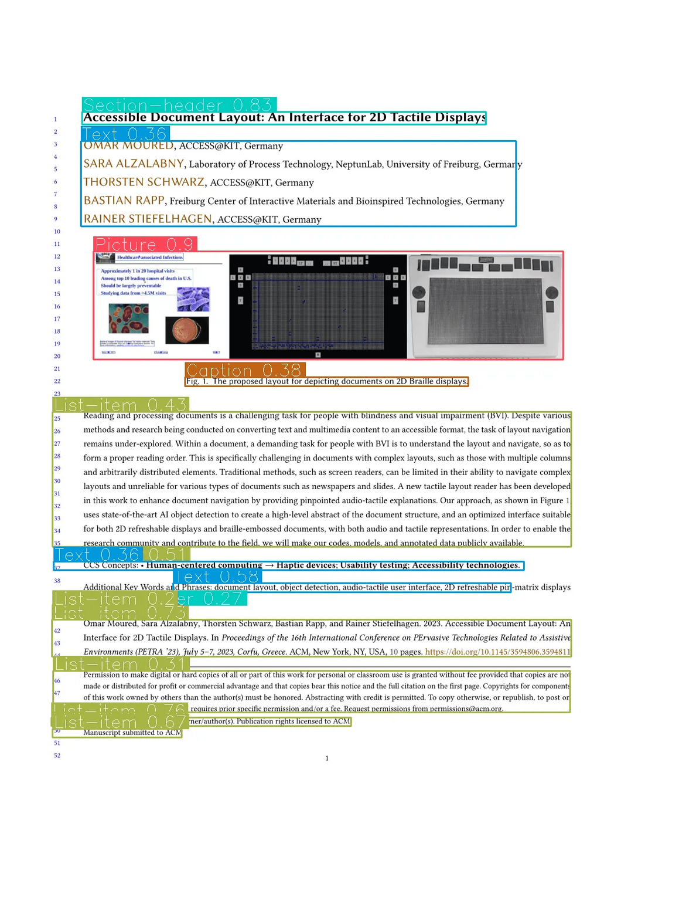

<div align="center">

<h3 align="center">YOLOv10 - Document Layout Analysis</h3>
</div>

<p align="center">
  <a href="https://huggingface.co/spaces/omoured/YOLOv10-Document-Layout-Analysis">
    
  </a>
  &nbsp;
  <a href="https://colab.research.google.com/github/moured/YOLOv10-Document-Layout-Analysis/blob/main/demo.ipynb">
    
  </a>
</p>

<!--
  <p align="center">
    Trained on DocLayNet dataset
    <br />
    <a href="https://huggingface.co/spaces/linhdo/document-layout-analysis">Live HuggingFace Demo</a>
    ·
    <a href="https://github.com/THU-MIG/yolov10">Visit YOLOv10</a>
    ·
    <a href="https://github.com/LynnHaDo/Document-Layout-Analysis/issues">Request Feature or Report Problem</a>
  </p>
</div>
-->

## Updates 🔥

I have trained YOLOv10 on the DocLayNet dataset for this project. Below is the results table. Feel free to use our fine-tuned models, and please remember to cite YOLOv10, DocLayNet, and our repository. If you find this repository useful, don't forget to give it a 🌟!

- **02/06/2024**: HuggingFace demo is live with YOLOv10-x model best weights.
  
<!-- ABOUT THE PROJECT -->
## About The Project

The models were fine-tuned using 4xA100 GPUs on the Doclaynet-base dataset, which consists of 6910 training images, 648 validation images, and 499 test images.

<p align="center">
  
</p>

### Results
| Model   | mAP50 | mAP50-95 |
|---------|-------|----------|
| YOLOv10-x | 0.924 | 0.74 |
| YOLOv10-b | 0.922 | 0.732 |
| YOLOv10-l | - | - |
| YOLOv10-m | - | - |
| YOLOv10-s | - | - |
| YOLOv10-n | - | - |

### Installation
```
conda create -n yolov10 python=3.9
conda activate yolov10
git clone https://github.com/THU-MIG/yolov10.git
cd yolov10
pip install -r requirements.txt
pip install -e .
```

## References
1. YOLOv10
```
BibTeX
@article{wang2024yolov10,
  title={YOLOv10: Real-Time End-to-End Object Detection},
  author={Wang, Ao and Chen, Hui and Liu, Lihao and Chen, Kai and Lin, Zijia and Han, Jungong and Ding, Guiguang},
  journal={arXiv preprint arXiv:2405.14458},
  year={2024}
}
```

   
2. DocLayNet
```
@article{doclaynet2022,
  title = {DocLayNet: A Large Human-Annotated Dataset for Document-Layout Analysis},  
  doi = {10.1145/3534678.353904},
  url = {https://arxiv.org/abs/2206.01062},
  author = {Pfitzmann, Birgit and Auer, Christoph and Dolfi, Michele and Nassar, Ahmed S and Staar, Peter W J},
  year = {2022}
}
```

## Contact
LinkedIn: [https://www.linkedin.com/in/omar-moured/](https://www.linkedin.com/in/omar-moured/)
